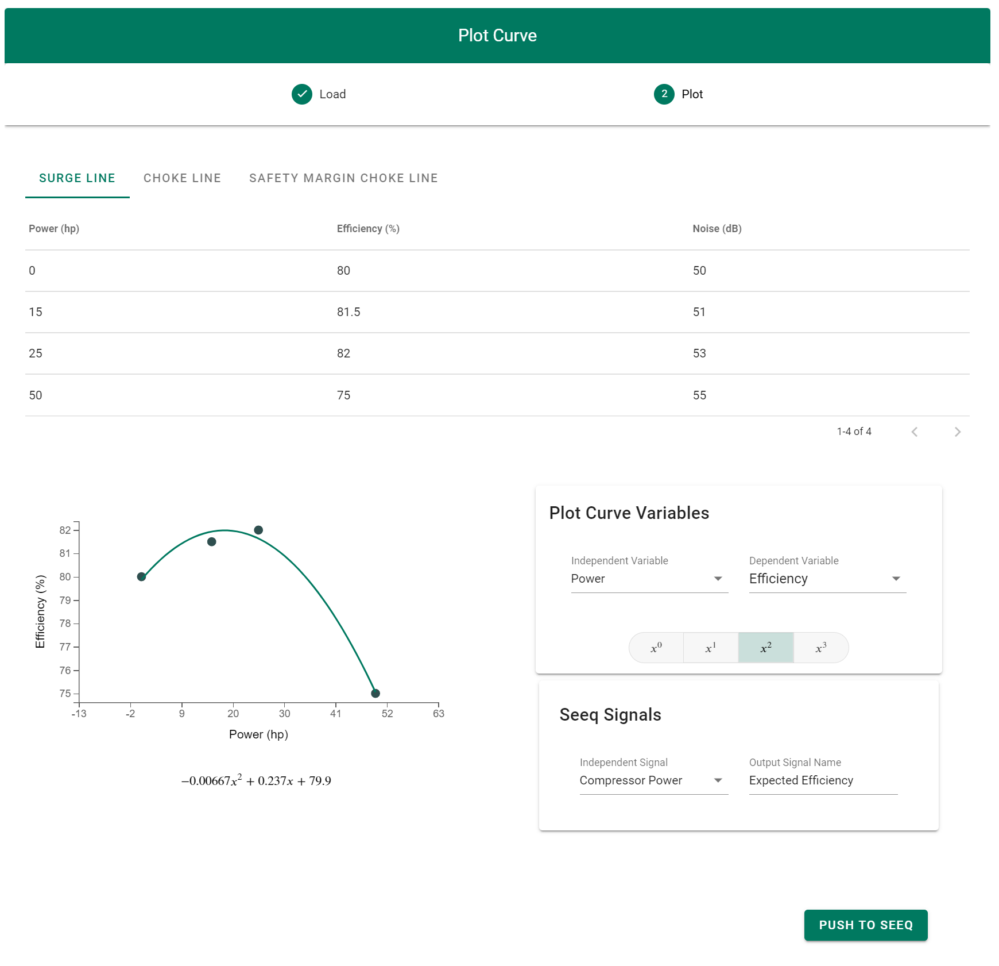
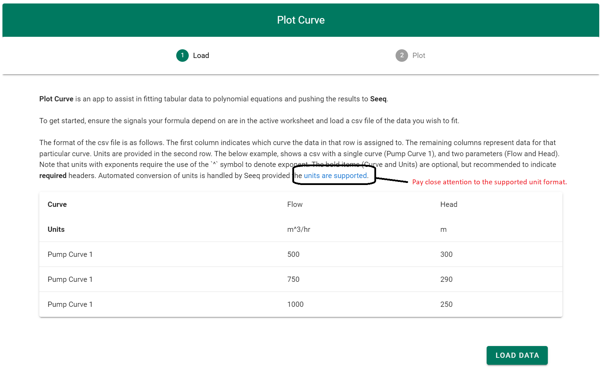

# User Guide

<table>
   <td>
      
   </td>
</table>

## Overview

A general overview of the motivation for and functionality of Plot Curve, as implemented in
**seeq-plot-curve** is provided in this section.

### The Problem

When working with time series data, it is very common to want to create a new signal based on a relationship or function with 
an existing signal.  When the  formula for the calculation is simple and known, it can be directly input into Seeq 
via the formula editor.  But many relationships are empirical in nature, represented by data points which describe the 
relationship between variables.  

Some examples may include :

- Equipment Curves 
  - A [pump curve](https://www.google.com/url?sa=i&url=https%3A%2F%2Fwww.pumpsandsystems.com%2Funderstanding-pump-curves&psig=AOvVaw1vTS_8NFaEJZ1ICnwKBoN3&ust=1643391727854000&source=images&cd=vfe&ved=0CAsQjRxqFwoTCKD-hrO90vUCFQAAAAAdAAAAABAD) providing the relationships between flow, head, efficiency, etc
  - A [valve curve](https://www.google.com/url?sa=i&url=https%3A%2F%2Fwww.industrialcontrolsonline.com%2Ftraining%2Fonline%2Fcontrolling-flow-ball-valves&psig=AOvVaw0_zt9UE6iAyvddeIh4UnAJ&ust=1643391749751000&source=images&cd=vfe&ved=0CAsQjRxqFwoTCOCw6r290vUCFQAAAAAdAAAAABAF) describing the relationship between the flow coefficient of a valve and its opening percentage
- Experimental Data
  - Product properties (i.e. blend ratio properties, property estimation)
  - Physical effects of additives (i.e. [drag reducing agents](https://www.google.com/url?sa=i&url=https%3A%2F%2Fpdfs.semanticscholar.org%2F2353%2F62a58dbe58225041b237051a0c5bcf878879.pdf&psig=AOvVaw1uwr55SV-C2NGprdLKOe4Q&ust=1643391817067000&source=images&cd=vfe&ved=0CAsQjRxqFwoTCMj-w9690vUCFQAAAAAdAAAAABAD))
  
There also may be many unique curves that we wish to integrate into Seeq, and the units may (or may not) match the units 
of the input signal.  This process can be time consuming and error prone.

*Plot Curve* is a minimal tool to solve the problem of efficiently fitting tabular data with polynomial functions that can
be pushed to Seeq as formulas.  It allows for previewing of the functions and manual selection of the polynomial order.

## Usage

### Workflow Instructions

1. Add all relevant dataset signals to the trend view. Any time range is acceptable, but any dependent signals should
   be added to the trend view *before* launching the Plot Curve Application.
2. From the Tools tab in Workbench, select Add On Tools followed by *PlotCurve*.  After a moment the tool will load, you 
   will be prompted to select the data to be plotted.  Some instructions are provided on this screen, indicating the 
   required file format, and [providing a link to supported units](https://seeq.atlassian.net/wiki/spaces/KB/pages/112761878/Units+of+Measure+UOM).
   *Units must be in a Seeq supported format to allow for proper conversion.* 

<table>
   <td>
      
   </td>
</table>

3. Once a file has been selected, the plotting screen is loaded and the following *plot curve* variables can be adjusted :
- *Selected Curve* : This is the selected curve from column 1 of the input file as shown above.
- *Independent Variable* : This is which variable from the input file should be used as the 'x' axis variable.  The units
  of this variable must be compatible with the units of Seeq dependent signal.  See the animated gif for an example.
- *Dependent Variable* : This is which variable from the input file should be used as the 'y' axis variable.  The resulting
  Seeq signal will have units corresponding to this variable.
- *Equation Order* : This is the order of the polynomial equation to be used for the formula.

<table>
   <td>
      
   </td>
</table>

4. After a reasonable equation has been fit to the data, the next step is to select a signal from Seeq that will be used
   to calculate the new predicted/dependent variable.  The output signal name should be a unique name signal name as it will be pushed to workbench.

5. Finally, when we are happy with the signal names, and the curve, we can push the formula to Seeq.  After a few minutes,
   the new signal will appear in the active worksheet.  If we have provided signal names for multiple curves, then a dialog
   will ask us if we want to push all signals, or only the active curve.

<table>
   <td>
      
   </td>
</table>

<table>
   <td>
      
   </td>
</table>

